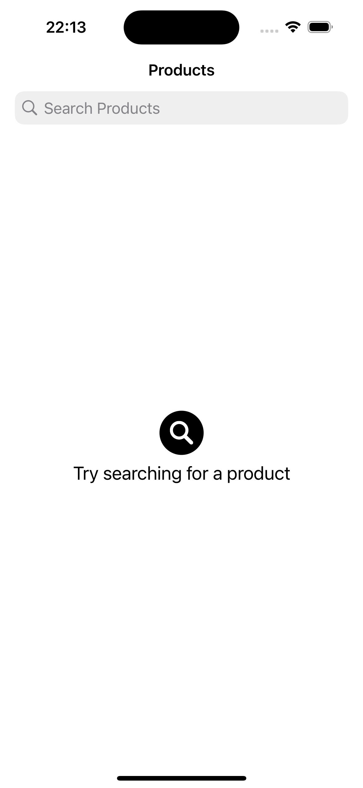

# CoolBlue Search App

## Overview

### Design Pattern: MVVM-C Architecture
The basic app follows the **MVVM-C** (Model-View-ViewModel-Coordinator) architecture, that promotes separation of concerns and maintains a clean structure. Here's how it works:

- Minimum deployment version is 18.2
- Xcode version 16.2
- Only portrait orientation supported for iPhone and iPad

- **Model**: Represents the app’s data using DTO's
- **View**: Handles the UI and user interactions.
- **ViewModel**: Provides data to the view and responds to user actions and business logic.
- **Coordinator**: Manages navigation and the flow between views, ensuring modular and scalable navigation, especially for more complex apps.

### Reactive Programming: Swift Concurrency
Swift Concurrency is utilized across the app to manage asynchronous tasks using `async/await` and `Task`. I chose Swift Concurrency over Combine due to its simpler syntax and reduced need for chaining, which makes the codebase more readable and easier to maintain. The decision was also based on the need for more straightforward async handling, without the complexities that Combine introduces.

### Dependency Injection
The app uses a simple **DependencyContainer** class to instantiate and manage the necessary services. These services are injected into the **MainCoordinator**, and then passed down to the `ViewModel` instances that require them. This approach, combined with **protocol-oriented programming**, ensures that the code remains modular, easy to test, and maintainable. This Depdency could also be injected as a environment variable, but I decided to inject inside the View.

### Third-Party Libraries
No third-party libraries have been used in this project, including for mocking. While I considered using **Sourcery** for code generation, I decided it would be overkill for this project, as the app's requirements are simple and straightforward.

### Features
- Strings are hardcoded but should be somewhere central or implemented using some framework such as lokalise 
- Pagination is implemented for fetching products
- Unit tests are added for Networking and SearchListViewModel, all other unit tests are required but not implemented in the given time period.
- Seperate Targets created for Unit tests and UI tests
- Swift concurrency check is on **Complete**
- Basic accessibility has been taken into account, such as voice over and hardware keyboard
- Tasks are created but cancelation has not been taken into account, since there the data is not changing much
- Protocols are added for all viewModels for testability
- Basic Factory design pattern is applied for building Views along with depdency injection.
- Project is using buildable folders

## TODO Improvements

- **Unit Testing**: Additional unit tests are needed for the remaining ViewModels to ensure proper functionality and catch edge cases.
- **UI Tests**: The current UI tests need to be split into separate test cases, covering all possible scenarios for better test coverage.
- **Image Caching Optimization**: While `AsyncImage` works fine for this app, there is room for improvement in image caching. More advanced image caching and optimization should be implemented to improve memory management and performance in future updates.
- **Refactor detailsView** The ProductDetails view has not been taken into account and is implemented with a basic UI such that navigation is possible and the relevant product can be seen

|  |  |
|-----------------------------------------------|-----------------------------------------------|
